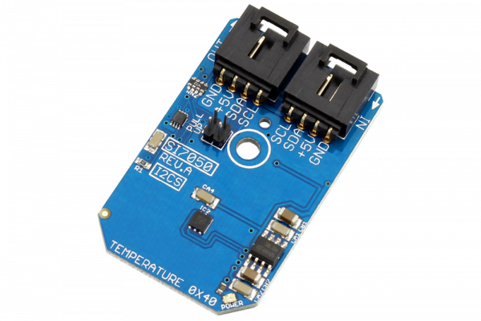

# SI7050

The SI7050 is a high accuracy temperature sensor with a low power consumption.This device supports up to 400kHz communication speed and an average current consumption of 195nA.The Si7050 also includes an anolog-to-digital converter capable of 14-Bit resolution.
This Device is available from www.ncd.io 

[SKU: SI7050_I2CS]

(https://store.ncd.io/product/si7050-high-accuracy-temperature-sensor-%C2%B11-0c-i2c-mini-module/)
This Sample code can be used with Arduino.

Hardware needed to interface SI7050 sensor with Arduino

1. <a href="https://store.ncd.io/product/i2c-shield-for-arduino-nano/">Arduino Nano</a>

2. <a href="https://store.ncd.io/product/i2c-shield-for-arduino-micro-with-i2c-expansion-port/">Arduino Micro</a>

3. <a href="https://store.ncd.io/product/i2c-shield-for-arduino-uno/">Arduino uno</a>

4. <a href="https://store.ncd.io/product/dual-i2c-shield-for-arduino-due-with-modular-communications-interface/">Arduino Due</a>

5. <a href="https://store.ncd.io/product/si7050-high-accuracy-temperature-sensor-%C2%B11-0c-i2c-mini-module/">SI7050 Temperature Sensor</a>

6. <a href="https://store.ncd.io/product/i%C2%B2c-cable/">I2C Cable</a>

SI7050:

The SI7050 is a high accuracy temperature sensor with a low power consumption.This device supports up to 400kHz communication speed and an average current consumption of 195nA.The Si7050 also includes an anolog-to-digital converter capable of 14-Bit resolution.

Applications:

• HVAC/R

• Thermostats

• White goods

• Computer equipment

• Portable consumer devices

• Battery protection

• Industrial controls

• Medical equipment

How to Use the SI7050 Arduino Library

The SI7050 has a number of settings, which can be configured based on user requirements.
          
1.Address calling:The following command is used to call the SI7050 sensor to begin the transmission.

           si.getAddr_SI7050(SI7050_DEFAULT_ADDRESS);   // 0x40, 1000 000
         
2.Temperature mode:The following command is used to measure temperature in NO HOLD master mode.             
             
          si.setTempMode(TEMP_NO_HOLD);        // Measure Temperature, No Hold Master Mode

